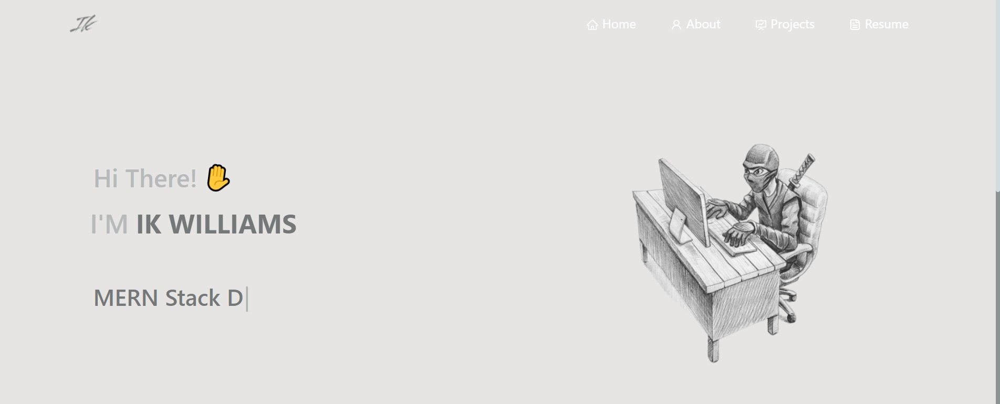

<h2 align="center">
  Portfolio Website - v1.1.0 
  <a href="https://portfolio-ikswaqqs40.vercel.app//" target="_blank">View my Portolio live</a>
</h2>

  

 

My personal portfolio <a href="#" target="_blank">Ik williams</a> which features some of my github projects as well as my resume and technical skills. 

This project was built using these technologies.
 
## Built With

- React.js
- CSS3
- Visual Studio
- Vercel

## Features

**? Multi-Page Layout**

**? Styled with React-Bootstrap and Css with easy to customize colors**

**? Fully Responsive**
